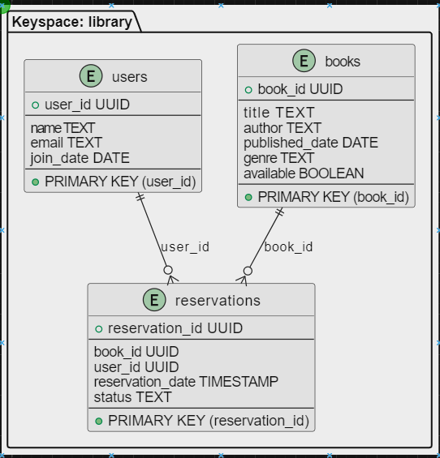

# Library Management System

This project is a Library Management System using Apache Cassandra as the distributed database.

## Features
- Add, update, delete, and retrieve books
- Add, update, delete, and retrieve users
- Make, update, and view reservations

## Requirements
- Python 3.8
- Apache Cassandra
- PyCharm IDE (optional)

## Setup
1. Install Docker and set up a multi-node Cassandra cluster.
    ```bash
    docker network create cassandra-network
    docker run --name cassandra-node1 --network cassandra-network -d cassandra:3.11
    docker run --name cassandra-node2 --network cassandra-network -e CASSANDRA_SEEDS=cassandra-node1 -d cassandra:3.11
    docker run --name cassandra-node3 --network cassandra-network -e CASSANDRA_SEEDS=cassandra-node1 -d cassandra:3.11
    docker run --name cassandra-node4 --network cassandra-network -e CASSANDRA_SEEDS=cassandra-node1 -d cassandra:3.11
    docker exec -it cassandra-node1 cqlsh
    DESCRIBE cluster;
    ```
2. Initialize the database schema:

    ``` bash
    CREATE KEYSPACE library WITH replication = {'class': 'SimpleStrategy', 'replication_factor': 3};

    USE library;

    CREATE TABLE books (
        book_id UUID PRIMARY KEY,
        title TEXT,
        author TEXT,
        published_date DATE,
        genre TEXT,
        available BOOLEAN
    );

    CREATE TABLE reservations (
        reservation_id UUID PRIMARY KEY,
        book_id UUID,
        user_id UUID,
        reservation_date TIMESTAMP,
        status TEXT
    );

    CREATE TABLE users (
        user_id UUID PRIMARY KEY,
        name TEXT,
        email TEXT,
        join_date DATE
    );
    ```
3. Clone the repository and navigate to the project directory.
4. Install the required Python packages:
    ```bash
    pip install cassandra-driver
    ```
5. Run the application using PyCharm or from the command line.

## Stress Tests
The project includes stress tests to ensure the system can handle a high load of requests.

## Database Schema


